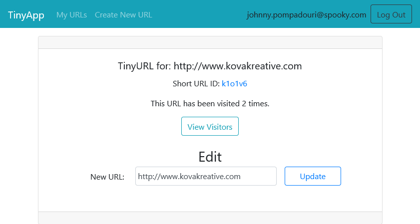
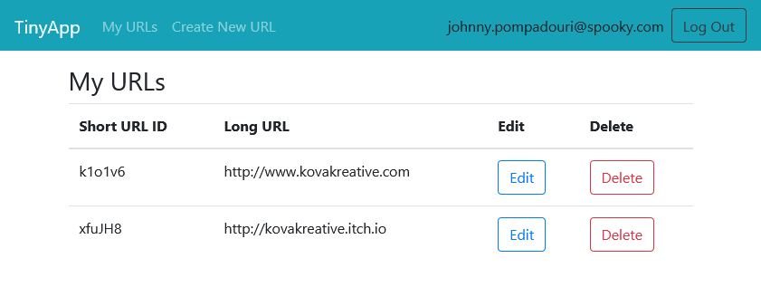
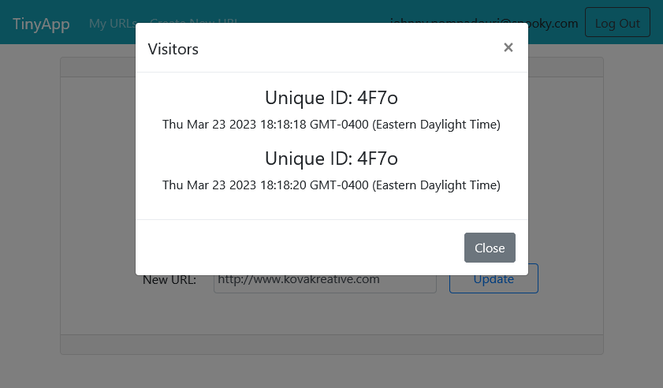

# TinyApp Project

TinyApp is a web application built with Node and Express that allows users to shorten long URLs (à la bit.ly). The only thing a user needs is to register for a free account and they can start generating short form URLs for any address.

## Final Product

The user interface is simple and minimalist and built with the [Bootstrap](https://getbootstrap.com/) toolkit.

The user can click Edit to not only edit each long URL, but also view some statistics about how active that link has been.

If a given URL has been visited at least once, the user can view the timestamp and how many unique times it has been viewed in a handy pop-up modal:

TinyApp is built with cookie and password encryption middleware, and ensures user security, so once you have it up and running, it's good to go!

## Dependencies

- Node.js
- Express
- EJS
- bcryptjs
- cookie-session
- method-override

## Getting Started

- Fork and clone, or download the repo to your machine.
- Install all dependencies (using the `npm install` command).
- Run the development web server using the `node express_server.js` command.